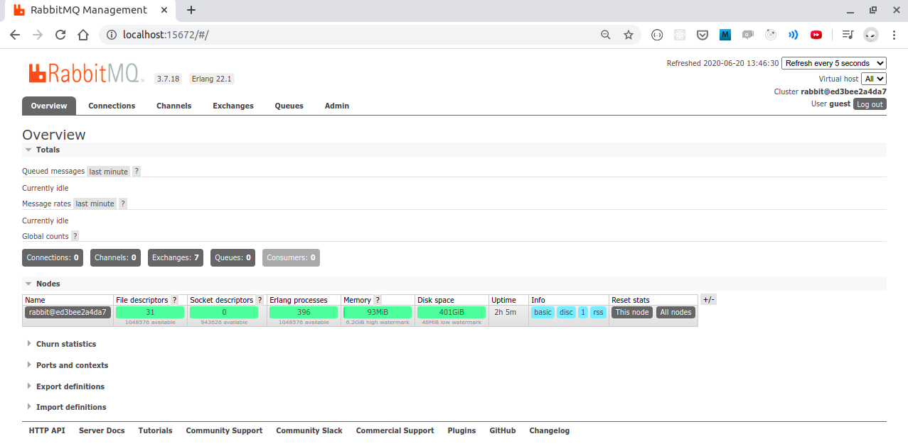

# RabbitMQ

In this repository we'll see how to implement RabbitMQ into a Java Application
according to [Java Client API](https://www.rabbitmq.com/api-guide.html). But first,
let's talk about concepts and advantages.

## Message Queue Concept
A message queue is a form of asynchronous service to service communication used
in serverless and microservices architectures. Messages are stored on the *queue*
until they are processed and deleted. Each message is processed only once, by
a single consumer.

## Advantages
- The message queues could simplify the development of applications that
needs to communicate asynchronously with each other. 
- There are no direct connections between applications, so it promotes 
the decoupling as seen in common coupled applications that uses HTTP-API 
communication.
- Promotes the single responsibility of applications and microservices 
architecture implementation.
- Promotes the improving of scalability, as it enable us to decouple 
different parts of our application and then scale them independently.
- Promotes resiliency. By splitting our app in different components by queues, 
we inherently create more resiliency. Our application can still be operational 
even if some component became unavailable.
- Better monitoring, message queues components enable us to easily monitor 
how many items are in a queue, the rate of processing messages, 
and other stats.

## What is RabbitMQ?

RabbitMQ is a open source software that implements the Advanced Message Queueing
Protocol ([AMQP](https://www.amqp.org)). This protocol is an open standard
for passing business messages between applications. It could connect different
systems built with different programming languages.

# Hands on

## Starting a local RabbitMQ broker

First of all, we will start our studies by creating and running a local Docker container 
with RabbitMQ broker. For this, we'll use an official RabbitMQ 
Docker Image from [DockerHub](https://hub.docker.com/_/rabbitmq).

```shell script
$ docker run -d -p 15672:15672 -p 5672:5672 --name rabbit-local rabbitmq:3-management
```

Wait the docker image download, container creation, starting and then validate 
that's up and running with `docker ps` command.
```shell script
$ docker ps

CONTAINER ID  IMAGE                  COMMAND                  CREATED             STATUS                  PORTS                                                                                        NAMES
ed3bee2a4da7  rabbitmq:3-management  "docker-entrypoint.s…"   About seconds ago   Up About seconds ago    4369/tcp, 5671/tcp, 0.0.0.0:5672->5672/tcp, 15671/tcp, 25672/tcp, 0.0.0.0:15672->15672/tcp   rabbit-local
```

Also, in addition, `rabbitmq:3-management` image tag provides the 
RabbitMQ Management Plugin interface. Go ahead and type in your
browser the follow address: `http://localhost:15672`. You will see
something like this:



If you saw the interface :point_up: you are ready to go.


